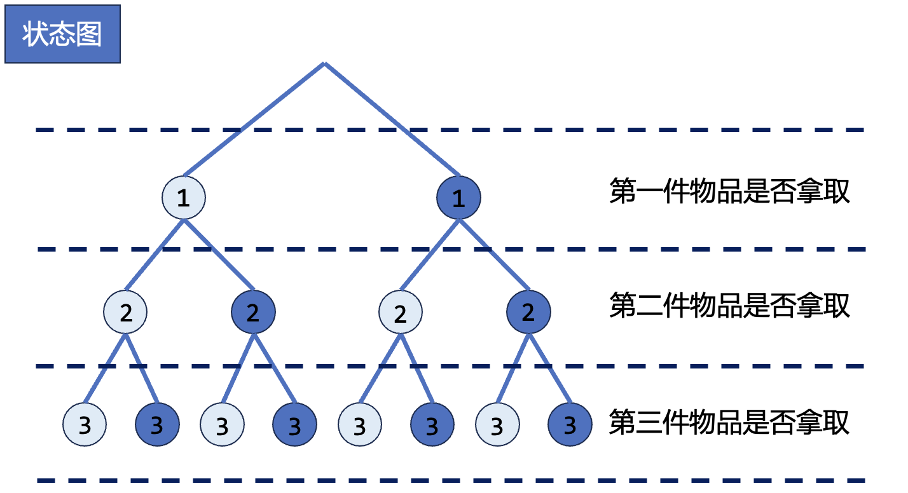
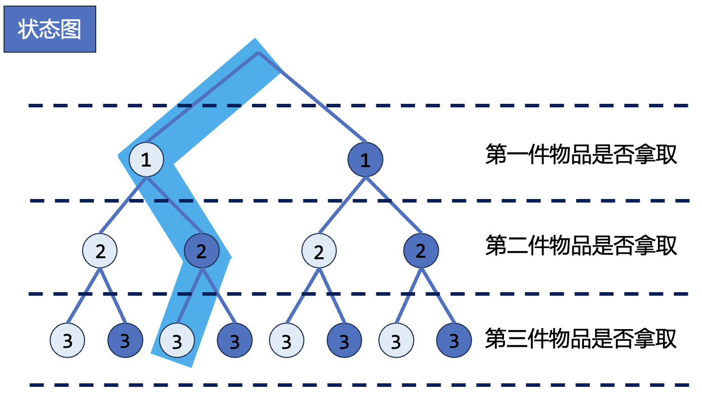
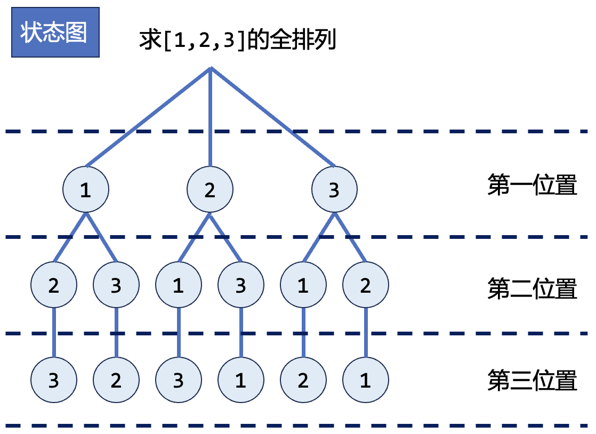
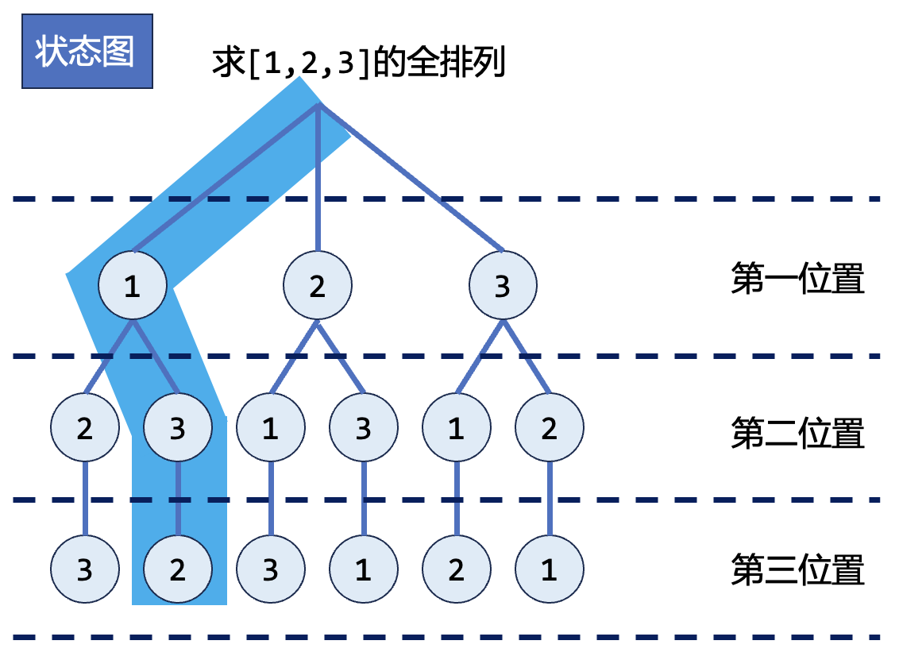
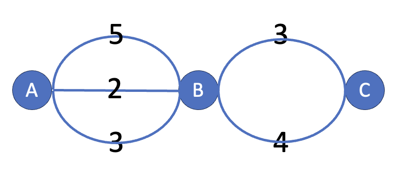
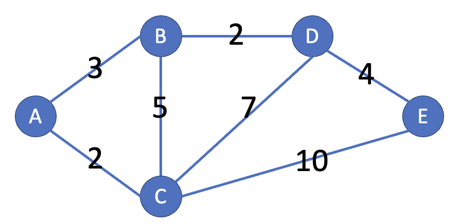
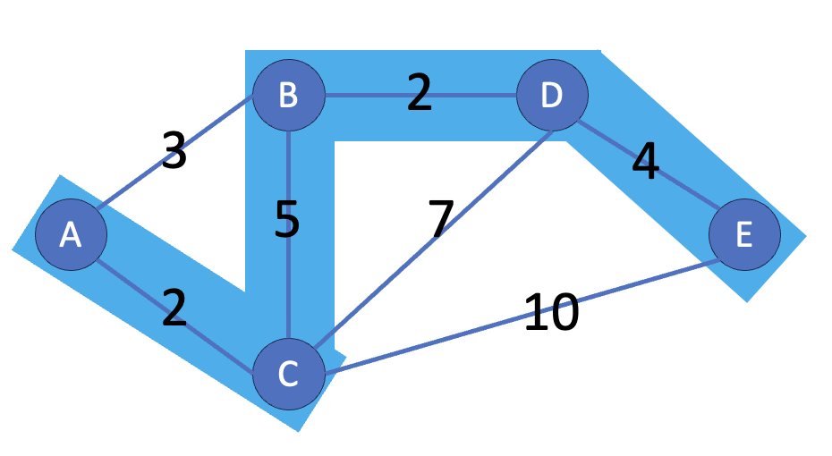

# 前言


# 目录


# 上课大纲

## CSP-J班
- Day 01 模拟算法
  - 基础语法、字符串处理、简单模拟
- Day 02 枚举算法
  - 循环枚举、子集枚举、排列枚举
- Day 03 基础数据结构与STL
  - 栈、队列与STL中的vector、queue、stack
- Day 04 排序与贪心
  - 基本排序算法与sort、贪心思想
- Day 05 二分
  - 二分查找、二分答案
- Day 06 阶段模拟赛
- Day 07 搜索
  - BFS、DFS
- Day 08 动态规划基础
  - 递推、一维动态规划、背包问题
- Day 09 数论基础
  - lcm、gcd、高精度、进制转换、素数筛法
- Day 10 全真模拟赛

## CSP-J/S班
- Day 01 基础算法串讲
  - 模拟、枚举、贪心、二分、前缀和、差分
- Day 02 数据结构与STL
  - 队列、栈、链表、堆
- Day 03 搜索
  - DFS、BFS、剪枝
- Day 04 图论1
  - 树、图、最短路、优化建图
- Day 05 阶段模拟赛
- Day 06 图论2
  - 拓扑序、并查集、最小生成树
- Day 07 动态规划1
  - 一维动态规划、背包问题
- Day 08 动态规划2
  - 区间动态规划、动态规划的常用优化
- Day 09 数论
  - lcm、gcd、高精度、进制转换、素数筛法、整数唯一分解定理、模运算与同余
- Day 10 全真模拟赛


# 知识点讲解

## 模拟

### 简介

模拟法是一种基本的算法思想，其主要特征是根据给定的规则编写程序，力求尽可能地展现原始计算过程的细节。

例如：

禾木的手机话费每天消费$1$元，每消费$3$元就可以获赠$1$元，一开始禾木有$10$元，问最多可以用多少天？

这类问题有的时候会有数学公式，可以找到初始金额与可使用天数的关系，但使用数学方法找到公式一般比较困难。而实际上，如果直接模拟手机话费消费的过程就比较简单。

编写代码时可以使用两个变量分别表示“话费余额”与“天数”，在循环结构中模拟每一天的消费情况，“天数”每增加$1$，“话费余额”就减少$1$元，并且当“天数”是$3$的倍数时，“话费余额”增加$1$元，当话费余额为$0$时停止循环，变量“天数”的值即是答案。参考代码如下：

```cpp
int day = 0, money = 10;
while (money)
{
    day++;
    money--;
    if (day % 3 == 0)
        money++;
}
cout << day << endl;
```

模拟题目通常具有码量大、操作多、思路繁复的特点。由于它码量大，经常会出现难以查错的情况，如果在考试中写错是相当浪费时间的。

### 要点

写模拟题时，遵循以下的建议有可能会提升做题速度：

-   在动手写代码之前，在草纸上尽可能地写好要实现的流程。
-   在代码中，尽量把每个部分模块化，写成函数、结构体或类。
-   对于一些可能重复用到的概念，可以统一转化，方便处理：如，某题给你 "YY-MM-DD 时：分" 把它抽取到一个函数，处理成秒，会减少概念混淆。
-   调试时分块调试。模块化的好处就是可以方便的单独调某一部分。
-   写代码的时候一定要思路清晰，不要想到什么写什么，要按照落在纸上的步骤写。

实际上，上述步骤在解决其它类型的题目时也是很有帮助的。

### 例题

[买铅笔](https://oj.hetao101.com/d/camp/p/P1909)

[三子棋](https://oj.hetao101.com/d/camp/p/A1001)


## 枚举

### 简介

枚举是基于已有知识来猜测答案的一种问题求解策略。

枚举的思想是不断地猜测，从**可能的集合**中一一尝试，然后再判断题目的条件**是否成立**。

### 要点

1. 确定解空间

    建立简洁的数学模型。

    枚举的时候要想清楚：可能的情况是什么？要枚举哪些要素？

2. 减少枚举的空间
   
    枚举的范围是什么？是所有的内容都需要枚举吗？

    在用枚举法解决问题的时候，一定要想清楚这两件事，否则会带来不必要的时间开销。

3. 选择合适的枚举顺序
   
    根据题目判断。比如例题中要求的是最大的符合条件的素数，那自然是从大到小枚举比较合适。

### 循环枚举

#### 简介

循环枚举是指按照问题本身的性质，用循环的方式枚举所有情况，通过判断或者统计的方式，解决问题。

当遇到问题中给出的数量范围不大的时候，就可以考虑使用循环枚举来解决问题。

例如：

公鸡一只 5 块钱，母鸡一只 3 块钱，小鸡三只 1 块钱，现在要用 100 块钱买 100 只鸡，问公鸡、母鸡、小鸡各买多少只？

这道题目我们就可以逐一尝试所有的购买方案，并判断是否满足鸡的数量是100只，且总价为 100 块钱。这就是基础的穷举法，参考代码如下：

```cpp
for (int i = 0; i <= 100; i++)                // 公鸡
    for (int j = 0; j <= 100; j++)            // 母鸡
        for (int k = 0; k <= 100; k++)        // 小鸡
            if (i + j + k == 100 &&           // 一共100只
                k % 3 == 0 &&                 // 小鸡必须是3的倍数
                i * 5 + j * 3 + k / 3 == 100) // 一共100块
                cout << i << " " << j << " " << k << endl;
```

在编写循环枚举时，需要注意时间复杂度，当发现问题无法使用最基础的枚举解决时，需要尽力思考优化方式，努力拿到更多的部分分！

#### 例题

[三角形个数](https://oj.hetao101.com/d/camp/p/P1008)

[计数问题](https://oj.hetao101.com/d/camp/p/P1980)

[连号区间数](https://oj.hetao101.com/d/camp/p/P1009)


### 子集枚举

#### 简介

子集是指一个集合中的部分元素所构成的集合。

如果集合A中的所有元素都包含在集合B中，则集合A是集合B的子集。

例如，如果集合A=$\{1,2\}$，集合B=$\{1,2,3\}$，那么集合A就是集合B的一个子集。

子集枚举就是列举出集合的所有子集，基于问题的需求，选择正确的解。

例如：

$X$企业有$3$名员工——$A、B、C$，你的任务是选择一些员工组成一个团队。你希望找出所有可能的团队组合，以便可以根据各种因素（比如技能、经验等）来做出最佳的选择。

可能存在的子集为：

一个人都不选：$空集\{\}$

每个团队只选一个人：$\{A\}$，$\{B\}$，

每个团队选两个人：$\{A,B\}$、$\{A,C\}$、$\{B,C\}$。

每个团队只选三个人：$\{ABC\}$。

这样就得到了**所有可能的团队组合**，然后你就可以基于你的**具体需求**（例如，每个员工的技能、经验等）来选择最佳的团队了。

#### 二进制枚举子集

二进制是枚举子集的一个常用方式。

二进制枚举子集有两个重要的环节：

1. 用十进制枚举所有状态。
2. 将十进制的二进制表达，解析成子集中某个元素是否存在。

**用十进制枚举所有状态**

在表示子集的时候，可以用数字1表示元素在子集里面，0表示不在子集里面。

把二进制数的每一位和集合的每一个元素对应。最低位和第一个元素对应，第二位和第二个元素对应，以此类推。这样就能根据二进制数得到对应的子集了。

例如二进制数`0010`。代表集合中共有$4$个元素，当前二进制数代表的子集只含有第二个元素。

如果我们现有三样物品，它们的所有子集（拿取方式）和二进制的对应关系如下：

| 二进制 |    子集     |
| :----: | :---------: |
| $000$  |   $\{\}$    |
| $001$  |   $\{1\}$   |
| $010$  |   $\{2\}$   |
| $011$  |  $\{1,2\}$  |
| $100$  |   $\{3\}$   |
| $101$  |  $\{1,3\}$  |
| $110$  |  $\{2,3\}$  |
| $111$  | $\{1,2,3\}$ |

我们可以发现这里面的二进制其实就是十进制中的 $0 \sim 7$。因此在十进制中枚举$0 \sim 7$就可以枚举三件物品的所有子集了。

$0 \sim 7$中的$7$其实就是$2^3 - 1$，因为一个物品有两个状态——拿取和不拿取，根据乘法原理，所以$3$个物品就共有$2^3$种状态，因此，若有$n$件物品，那么只需要**枚举十进制下的$0 \sim 2^n - 1$**就可以枚举它们的所有子集了，$2^n$可以通过左移操作，写成`1 << n`。

**将十进制的二进制表达，解析成子集中某个元素是否存在**

判断十进制数的二进制表达中，每一个数位上的数是$1$还是$0$，可以借助左移`<<`和按位与`&`操作。

例如，假设现在有三件物品，当前枚举到的十进制数是$6$，其对应的二进制数就是$110$。$110$代表当前枚举的子集中，存在第二件物品和第三件物品。

判断$110$上各个位置是否为$1$，可以让$110$和$001、010、100$分别进行按位与操作：

- `110 & 001 = 0`，代表第一个物品没有出现。
- `110 & 010 = 1`，代表第二个物品出现了。
- `110 & 100 = 1`，代表第三个物品出现了。

`注：此处的计算结果1和0，代表bool意义上的1和0，表示某个物品是否出现过。例如110 & 010其实等于3，但是任何非零数都是bool意义下的1。`

所以，对任意一个数字$i$，将它和$1$左移$n$的结果进行按位与`&`运算，就能通过运算结果判断，其从右向左数第$n - 1$位上的数字，是否为$1$。

```cpp
for (int i = 0; i < n; i++)
    cin >> a[i];
for (int i = 0; i < (1 << n); i++)
{
    for (int j = 0; j < n; j++)
        if (i & (1 << j))
            cout << a[j] << "";
    cout << endl;
}
```

如果要限制子集的元素个数，可以编写一个循环，简单计数一下当前枚举的子集中有几个$1$，当然也可以使用`__builtin_popcount()`函数来辅助处理，`__builtin_popcount(x)`会返回$x$在二进制下，各个数位上1的个数。

```cpp
for (int i = 0; i < n; i++)
    cin >> a[i];
for (int i = 1; i < (1 << n); i++)
{
    if (__builtin_popcount(i) != m)
        continue;
    for (int j = 0; j < n; j++)
        if (i & (1 << j))
            cout << a[j] << "";
    cout << endl;
}
```

#### 递归枚举子集

使用递归枚举子集的重点在于理清每件物品的选取状态。

下图为三件物品的不同拿取方案的状态图：



上图中，`深色点`为选取某一件物品， `浅色点`为不拿取某一件物品，因此在这幅状态图中，自上而下选择一条路径，其实就是一个子集。



例如在上图中选择的路径，就代表着**当前枚举的子集，只含有第二件物品**。

每一件物品都有两种状态 —— 拿取 和 不拿取 ，所以定义bool数组$flag$，表示每个物品是否被拿取：

- `flag[num] = 1`，表示物品$num$被拿取；
- `flag[num] = 0`，表示物品$num$没被拿取。

定义函数$f$，让$f(num)$来处理物品$num + 1$是否被选中：

- 首先让$num + 1$不被选中，就让$flag[num + 1] = 0$，再调用$f(num + 1)$，继续枚举后面的物品是否被选中。
- 接着让$num + 1$被选中，就让$flag[num + 1] = 1$，再调用$f(num + 1)$，继续枚举后面的物品是否被选中。
- 当$num$等于$n$时，意味着$n$个物品都被操作过了，那就根据数组$flag$的情况，输出所有被选中的物品，即当前枚举的子集。

```cpp
int f(int num)
{
    // 输出当前枚举的子集
    if (num == n)
    {
        for (int i = 1; i <= n; i++)
            if (flag[i] == 1)
                cout << i;
        cout << endl;
        return 0;
    }
    // 不拿取物品num + 1
    flag[num + 1] = 0;
    f(num + 1);
    // 拿取物品num + 1
    flag[num + 1] = 1;
    f(num + 1);
}
```

同样的，递归枚举子集也可以限制子集的长度。

可以额外定义一个参数$cnt$用来计数子集内物品的数量，当选择这件物品时，就将$cnt$加一，下面提供一种实现方式：

```cpp
int f(int num, int cnt)
{
    // 输出当前枚举的子集
    if (num == n)
    {
        if (cnt == m)
        {
            for (int i = 1; i <= n; i++)
                if (flag[i] == 1)
                    cout << a[i] << " ";
            cout << endl;
        }
        return 0;
    }
    // 不拿取物品num+1
    flag[num + 1] = 0;
    f(num + 1, cnt);
    // 拿取物品num+1
    flag[num + 1] = 1;
    f(num + 1, cnt + 1);
}

```

#### 例题

[所有子集](https://oj.hetao101.com/d/camp/p/Z1014)

[限制数量的子集](https://oj.hetao101.com/d/camp/p/Z1015)

[perket](https://oj.hetao101.com/d/camp/p/Z1019)

[选数](https://oj.hetao101.com/d/camp/p/P1014)

[砝码称重](https://oj.hetao101.com/d/camp/p/P1441)

[药剂制作](https://oj.hetao101.com/d/camp/p/A2048)

[期末考试](https://oj.hetao101.com/d/camp/p/P1015)

### 排列枚举

#### 简介

一般地，从$n$个不同元素中取出$m（m \le n）$个元素，按照一定的顺序排成一列，叫做从$n$个元素中取出$m$个元素的一个排列(permutation)。

特别地，当$m=n$时，这个排列被称作全排列(all permutation)。

$n$个元素的全排列个数为$n!$，因为全排列实际上就是把$n$件物品打乱顺序，放在$n$个位置里，第一个位置有$n$种选择，第二个位置就有$n - 1$种选择，因为第一个位置已经确定了一件物品的摆放，第三个位置就有$n - 2$种选择，以此类推...根据乘法原理，$n$件物品的全排列个数就为$n!$。

例如$1, 2, 3$的全排列为：

$1 2 3, 1 3 2, 2 1 3, 3 1 2, 3 2 1$。

#### 函数法求全排列

可以使用`next_permutation()`对数组求全排列。

该函数收纳于库`<algorithm>`中，它有三个参数$start$、$end$和$cmp$，表示待处理序列的起始地址、终止地址和排序规则。cmp是自定义比较方法，可缺省。

`next_permutation()`函数会按照字母表顺序生成现有序列的下一个较大的序列，并保存在原来的地址中。例如现有序列为$1,2,3$，那么下一个生成的序列就是$1,3,2$，对$1,3,2$再运行一次函数，生成的就是$2,1,3$。

函数返回值为bool类型，若当前已是字典排列的最后一个则返回$false$，否则返回$true$。

```cpp
for (int i = 1; i <= n; i++)
    num[i] = i;
do
{
    for (int i = 1; i <= n; i++)
    {
        cout << num[i] << " ";
    }
    cout << endl;
} while (next_permutation(num + 1, num + n + 1));
```

#### 递归法求全排列

使用递归求排列的关键在于确定当前位置放置的物品后，下一个位置可以放哪些物品。

下图为每个位置可以放置物品的状态图：



上图中，自上而下的每一条路径，就是一种排列方式。



例如在上图中选择的路径，表达的就是$1,3,2$这种排列。

用数组$num$记录当前的排列。

数组$flag[i]$表示物品$i$是否已经在排列中:

- `flag[i] = 1`，表示物品$i$已经在排列中。
- `flag[i] = 0`，表示物品$i$不在排列中。

定义函数$f$，让$f(cnt)$来处理第$cnt + 1$位置上的物品：

- 在选择第$cnt + 1$位置上的物品时，使用循环枚举所有物品，如果物品$a[i]$没有被选择，那么就选择物品$a[i]$放在第$cnt + 1$位置上，即`num[cnt + 1] = a[i]`，并标记物品$a[i]$已经被使用过了，即`flag[i] = 1`。
- 当$cnt$等于$n$时，代表所有位置上的物品都被确定了，就可以输出在`num`中记录的排列。

```cpp
int f(int cnt)
{
    if (cnt == n)
    {
        for (int i = 1; i <= n; i++)
            cout << num[i] << " ";
        cout << endl;
    }
    for (int i = 1; i <= n; i++)
    {
        if (flag[i] == 0)
        {
            flag[i] = 1;
            num[cnt + 1] = a[i];
            f(cnt + 1);
            flag[i] = 0;
        }
    }
}
```

#### 例题

[全排列](https://oj.hetao101.com/d/camp/p/Z1020)

[火星人](https://oj.hetao101.com/d/camp/p/P1017)

[吃奶酪](https://oj.hetao101.com/d/camp/p/P1018)

[缆车](https://oj.hetao101.com/d/camp/p/P1021)

## 贪心

### 简介

贪心算法，是用计算机来模拟一个「贪心」的人做出决策的过程。这个人十分贪婪，每一步行动总是按某种指标选取最优的操作。而且他目光短浅，总是只看眼前，并不考虑以后可能造成的影响。

例如：

有$3$座城市$A,B,C$，城市之间由若干条道路连接，求城市$A$到城市$C$的最短路程。例如下图表示的道路图中，城市$A$与城市$B$有三条道路，长度分别为$5,2,3$，城市$B$与城市$C$有两条道路，长度分别为$3,4$。



根据贪心的思想，我们着眼于眼前能看到的，在每座城市上，都只思考去往下一座城市的最短距离，因此，可得城市$A$到城市$C$的最短路程为$5$。

但是，并不是所有的时候贪心法都能获得最优解。

例如：

有$5$座城市$A,B,C,D,E$，城市之间的道路长度如下图所示，求从$A$城到达$E$城的最短距离。



如果按照贪心法求解，着眼于每一座城市后，可到达下一座城市的最短路径，路线图将如下图所示，该方案得到的最短路径长度为$12$。



但略微思考后，我们可以知道，显然下图所表示的方案路程更短，为$9$。


所以一般使用贪心法的时候，都要确保自己能证明其正确性。

### 适用范围

贪心算法在有最优子结构的问题中尤为有效。最优子结构的意思是问题能够分解成子问题来解决，子问题的最优解能递推到最终问题的最优解。

### 证明

贪心算法有两种证明方法：反证法和归纳法。一般情况下，一道题只会用到其中的一种方法来证明。

1.  反证法：如果交换方案中任意两个元素/相邻的两个元素后，答案不会变得更好，那么可以推定目前的解已经是最优解了。
2.  归纳法：先算得出边界情况（例如 $n = 1$）的最优解 $F_1$，然后再证明：对于每个 $n$，$F_{n+1}$ 都可以由 $F_{n}$ 推导出结果。

### 

### 例题


## 前缀和 & 差分

### 前缀和

前缀和可以简单理解为「数列的前 $n$ 项的和」，是一种重要的预处理方式，能大大降低查询的时间复杂度。

### 二维/多维前缀和

多维前缀和的普通求解方法几乎都是基于容斥原理。

比如我们有这样一个矩阵 $a$，可以视为二维数组：
    
```text
1 2 4 3
5 1 2 4
6 3 5 9
```

我们定义一个矩阵 $\textit{sum}$ 使得 $\textit{sum}_{x,y} = \sum\limits_{i=1}^x \sum\limits_{j=1}^y a_{i,j}$，  
那么这个矩阵长这样：

```text
1  3  7  10
6  9  15 22
12 18 29 45
```

第一个问题就是递推求 $\textit{sum}$ 的过程，$\textit{sum}_{i,j} = \textit{sum}_{i - 1,j} + \textit{sum}_{i,j - 1} - \textit{sum}_{i - 1,j - 1} + a_{i,j}$。

因为同时加了 $\textit{sum}_{i - 1,j}$ 和 $\textit{sum}_{i,j - 1}$，故重复了 $\textit{sum}_{i - 1,j - 1}$，减去。

第二个问题就是如何应用，譬如求 $(x_1,y_1) - (x_2,y_2)$ 子矩阵的和。

那么，根据类似的思考过程，易得答案为 $\textit{sum}_{x_2,y_2} - \textit{sum}_{x_1 - 1,y_2} - sum_{x_2,y_1 - 1} + sum_{x_1 - 1,y_1 - 1}$。

### 差分

差分是一种和前缀和相对的策略，可以当做是求和的逆运算。

这种策略的定义是令 $b_i=\begin{cases}a_i-a_{i-1}\,&i \in[2,n] \\ a_1\,&i=1\end{cases}$

-   $a_i$ 的值是 $b_i$ 的前缀和，即 $a_n=\sum\limits_{i=1}^nb_i$
-   计算 $a_i$ 的前缀和 $sum=\sum\limits_{i=1}^na_i=\sum\limits_{i=1}^n\sum\limits_{j=1}^{i}b_j=\sum\limits_{i}^n(n-i+1)b_i$

它可以维护多次对序列的一个区间加上一个数，并在最后询问某一位的数或是多次询问某一位的数。注意修改操作一定要在查询操作之前。


譬如使 $[l,r]$ 中的每个数加上一个 $k$，即

$$
b_l \leftarrow b_l + k,b_{r + 1} \leftarrow b_{r + 1} - k
$$

其中 $b_l+k=a_l+k-a_{l-1}$，$b_{r+1}-k=a_{r+1}-(a_r+k)$

最后做一遍前缀和就好了。

C++ 标准库中实现了差分函数 [`std::adjacent_difference`](https://zh.cppreference.com/w/cpp/algorithm/adjacent_difference)，定义于头文件 `<numeric>` 中。

## 二分

## 排序

## 搜索

## 动态规划

## 图论

## 数论

